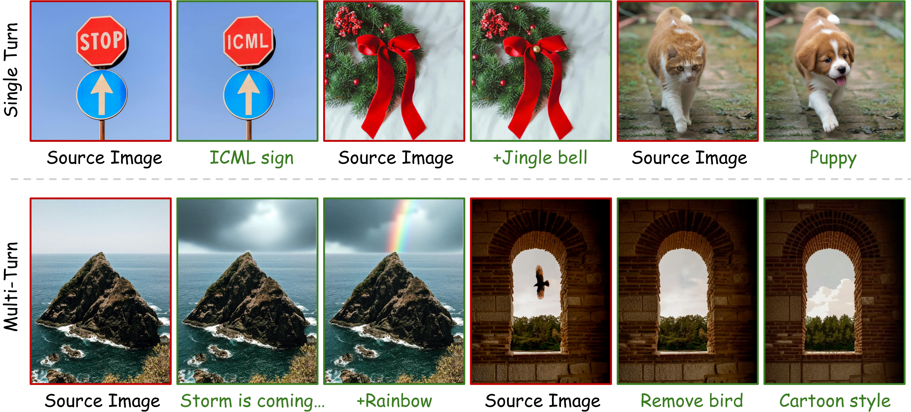

# DirectEdit: Step-Level Accurate Inversion for Flow-Based Image Editing

<div align="center">
<a href='https://arxiv.org/pdf/2605.02417'></a>
<a href='https://desongyang.github.io/Directedit/'></a>
</div>


<br>

<p align="center">

</p>


<p>
TL;DR: </strong>DirectEdit</strong> is a simple yet effective training-free editing method that eliminates the inherent reconstruction error of inversion, achieving precise background preservation and reliable feature sharing.
</p>


# 🔧 Setup
Install the conda environment:
```bash
conda env create -f environment.yml
conda activate directedit
```

Download the checkpoints [SD-3.5-medium](https://huggingface.co/stabilityai/stable-diffusion-3.5-medium), [FLUX.1 Dev](https://huggingface.co/black-forest-labs/FLUX.1-dev) and [SAM2](https://huggingface.co/facebook/sam2.1-hiera-large) on Hugging Face.

# 🚀 Inference on Real Image

You can edit your own images using the Gradio demo:

```python
python demo.py
```

or you can edit a single image with the following script:


``` python
python edit_real_flux_singleimg.py --recov_cfg 3\
                         --attn_ratio 0.1\
                         --src_path 'examples/1.jpg'\
                         --src_prompt 'a cup of coffee with a drawing of a tulip put on the wooden table.'\
                         --tar_prompt 'a cup of coffee with a drawing of a lion put on the wooden table.'\
                         --saved_path './'\
                         --mask_path 'mask_path'(Optional)

python edit_real_sd35_singleimg.py --recov_cfg 2\
                         --attn_ratio 0.3\
                         --src_path 'examples/1.jpg'\
                         --src_prompt 'a cup of coffee with a drawing of a tulip put on the wooden table.'\
                         --tar_prompt 'a cup of coffee with a drawing of a lion put on the wooden table.'\
                         --saved_path './'\
                         --mask_path 'mask_path'(Optional)
```

**Intuition of hyperparameters**:  

*recov_cfg*

- **Recommended**: 2.0 - 3.5
- The higher the CFG scale, the more closely the generated image aligns with the prompt. Values too small (<1.5) or too large (>4.0) will produce poor quality results.

*attn_ratio*
- **Recommended**: 0.05 - 0.3
- This hyperparameter influences the consistency between the edited region and the source image, where a greater number of injection steps results in higher similarity.

*mask_path*
- **Effect**: Achieving precise background preservation using masks.
- The mask can be obtained through segmentation or manual drawing. We provide a mask segmentation function in the Gradio demo; you can obtain the mask by clicking the edit object of the uploaded image. Alternatively, you can utilize `scripts/generate_mask.py` to automatically generate masks based on MLLM and SAM (requires configuring an API key).

We also provide batch scripts based on the [PIE-bench](https://github.com/cure-lab/PnPInversion) for evaluation: 

```
# Set python path
export PYTHONPATH=$(realpath "./"):$PYTHONPATH

# SD3.5 
python scripts/edit_real_sd35.py --inv_cfg 1 --recov_cfg 2 --attn_ratio 0.3 --src_path "PIE-bench" --saved_path "outputs/sd35"

# FLUX.1-dev
python scripts/edit_real_flux.py --inv_cfg 1 --recov_cfg 2 --attn_ratio 0.15 --src_path "PIE-bench" --saved_path "outputs/flux"

# Evaluation
python evaluation/evaluate.py --metrics "structure_distance" "psnr_unedit_part" "lpips_unedit_part" "mse_unedit_part" "ssim_unedit_part" "clip_similarity_source_image"  "clip_similarity_target_image" "clip_similarity_target_image_edit_part"\
 --result_path evaluation.csv\
 --edit_category_list 0 1 2 3 4 5 6 7 8 9 --tar_image_folder "outputs/flux"\
 --tar_method "flux_directedit"\
 --src_image_folder "PIE-bench/annotation_images"\
 --annotation_mapping_file "PIE-bench/mapping_file.json"
```

# 📖 Citation

If you find our work helpful, please cite our paper. Thanks for your support!

```
@article{yang2026directedit,
  title={DirectEdit: Step-Level Accurate Inversion for Flow-Based Image Editing},
  author={Yang, Desong and Ye, Mang},
  journal={arXiv preprint arXiv:2605.02417},
  year={2026}
}
```

# Acknowledgements
The code is largely based on [FTEdit](https://github.com/Pengchengpcx/FTEdit). Special thanks to the authors for making their code public!

# Contact
If you have any questions or concerns, please contact: desong.yang@whu.edu.cn.
